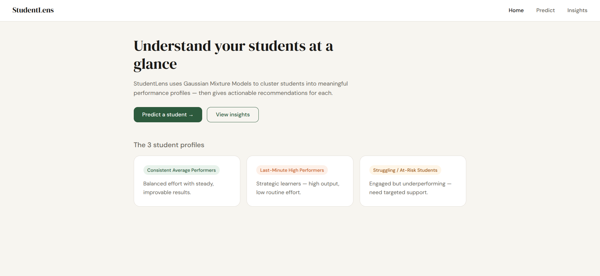
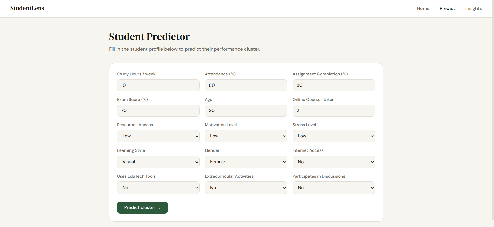
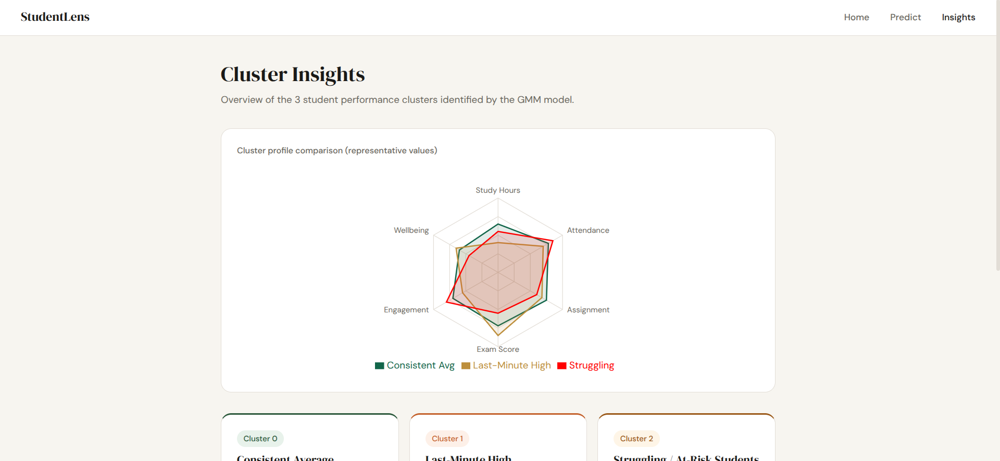
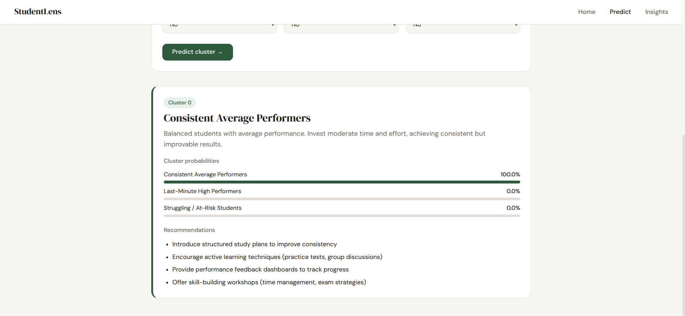
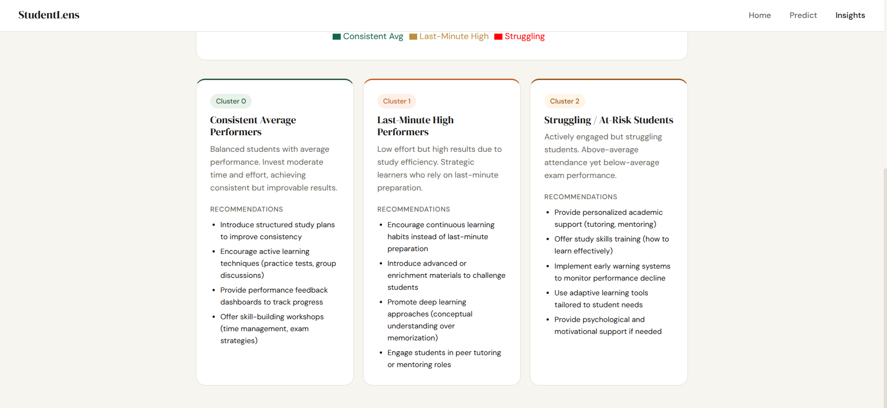

# StudentLens — Student Performance ML App
# Student-performance-analysis----ENSIA-Machine-Learning-Project
Student performance analysis dashboard based on real students data collected anonymously from National Higher School of Artificial Intelligence (ENSIA) -Algeria


## Live Demo
- Vercel: https://student-performance-analysis-ensia.vercel.app

## Screenshots

### Home


### Predict


### Insights


### test


### Clusters


## Setup

### 1. Train the model (once)
```bash
cd backend
pip install -r requirements.txt
python -m model.train
```
This reads `../data/student_performance.csv` and saves artifacts to `model/artifacts/`.

### 2. Run the backend
```bash
cd backend
uvicorn app:app --reload --port 8000
```

### 3. Run the frontend
```bash
cd frontend
npm install
npm run dev
```
Opens at http://localhost:5173 — API calls are proxied to port 8000 via Vite.

## API Endpoints
| Method | Path | Description |
|--------|------|-------------|
| POST | /predict | Predict cluster for a student |
| GET | /clusters | Get all 3 cluster summaries |
| GET | /clusters/{id} | Get one cluster detail |

## Notes
- Run `model.train` before starting the backend, or the predict endpoint will fail (no artifacts).
- The CSV must be at `data/student_performance.csv` (already placed there).
- `FinalGrade` column is used only for the unrealistic-flag logic in `clean_data`. If absent, remove that line in `prepare_data.py`.